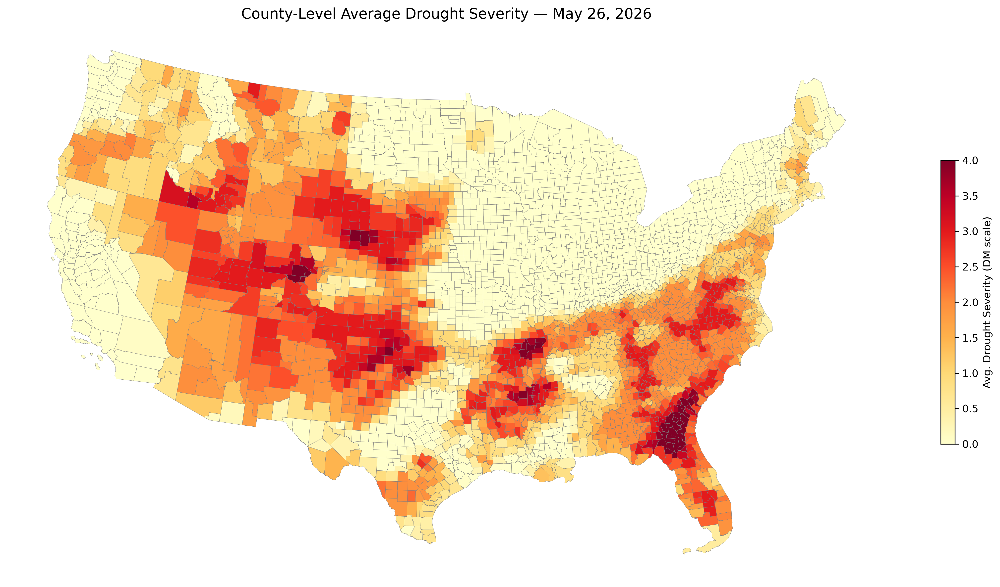
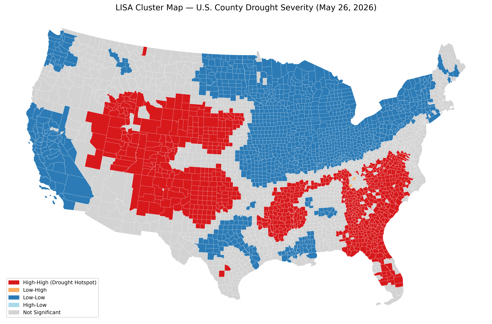

# U.S. County-Level Drought Hotspot Analysis

## Overview
This project identifies county-level drought hotspots across the contiguous United States 
using U.S. Drought Monitor data. Spatial autocorrelation methods (Moran's I and LISA) 
are used to determine whether drought severity forms significant spatial clusters.

## Data Sources
- U.S. Drought Monitor (May 26, 2026)
- U.S. Census TIGER/Line County Boundaries (2025)

## Methods
- Area-weighted drought severity calculation at the county level
- Global spatial autocorrelation (Moran's I)
- Local spatial autocorrelation (LISA cluster analysis)
- Interactive visualization (Bokeh)

## Key Findings
- 2,422 out of 3,109 CONUS counties had measurable drought coverage
- Highest drought severity concentrated in southern Georgia and northern Florida,
  with several counties reaching DM = 4.0 (Exceptional Drought)
- Moran's I = 0.9123 (p = 0.001), indicating very strong positive spatial autocorrelation
- LISA analysis identified 872 High-High drought hotspot counties, concentrated 
  in the West and Southeast
- 1,165 Low-Low counties identified in the northern Midwest and Northeast

## Tools & Libraries
- Python
- GeoPandas
- PySAL (libpysal, esda, splot)
- Matplotlib
- Bokeh

## Output Maps
### County-Level Drought Severity

### LISA Cluster Map

## Author
Khadijeh Asadi  
MS Student, CyberGIS and Geospatial Data Science  
University of Illinois Urbana-Champaign  
Spring 2026
